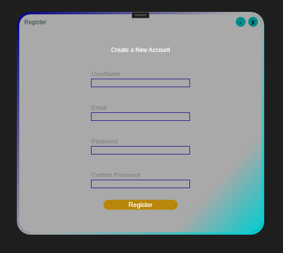
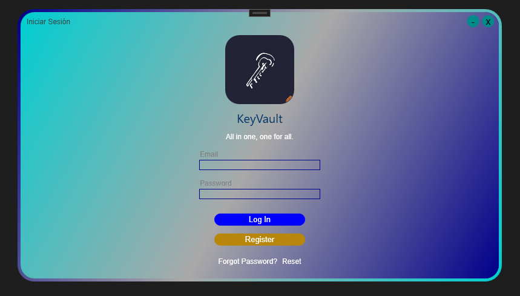
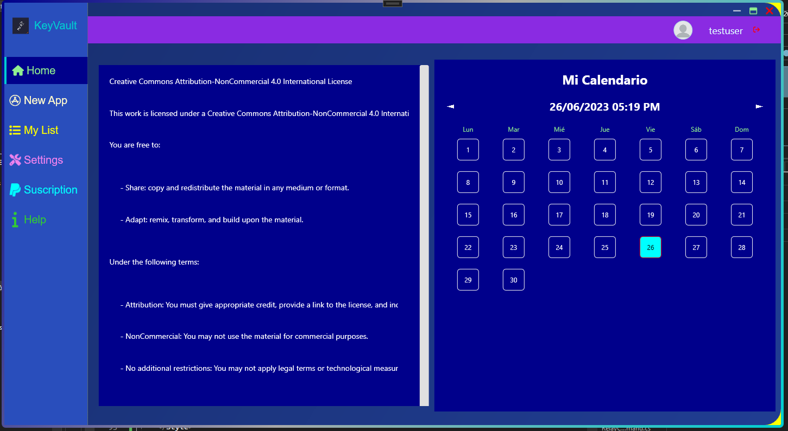
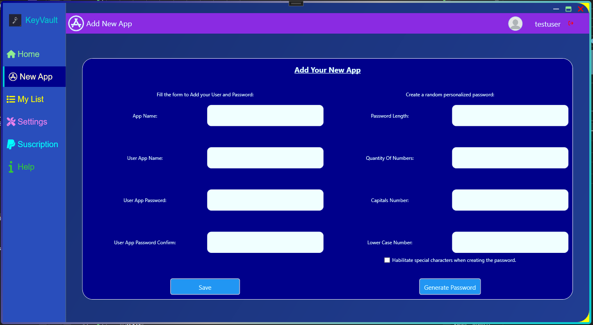
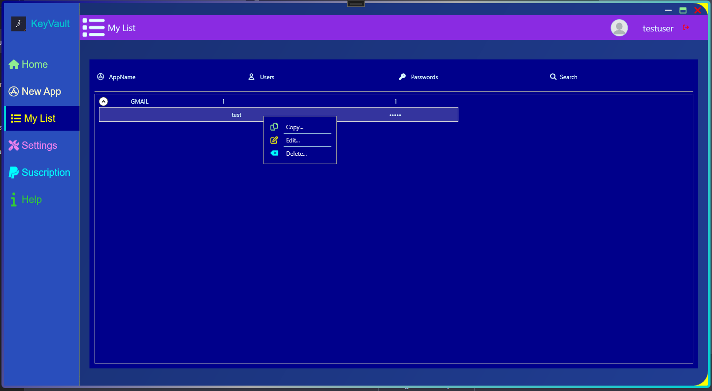
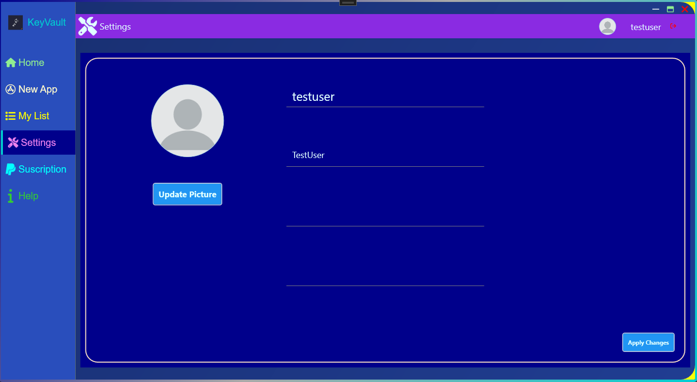

# PManager

Descripción breve del proyecto en una o dos frases.

## Descripción

Este proyecto es un ejemplo de una aplicación sencilla creada como parte de un proyecto escolar. La aplicación [KeyVault] permite [gestionar tus usuarios y contraseñas]. Fue desarrollada como una demostración para ilustrar los conceptos aprendidos durante el curso.

## Características

- [Generador de Contraseñas]: Genera Contraseñas Aleatorias.
- [Guarda tus Contraseñas]: Guarda las contraseñas utilizando RSA.
- [Roles de usuario]: (Planteado pero no implementado del todo).

## Capturas de Pantalla
  

    
    
------------------------------------------------------

  

  

    
     
------------------------------------------------------

  

  

    
     
------------------------------------------------------

  

  

    
     
------------------------------------------------------

  

  

    
     
------------------------------------------------------

  

  

    
     
------------------------------------------------------

  

## Tecnologías Utilizadas

- [WPF]
- [MVVM]

## Instalación

1. Clona el repositorio: `git clone https://github.com/usuario/repositorio.git`
2. Abre el proyecto en tu entorno de desarrollo preferido.
3. Configura las dependencias y entorno de ejecución según sea necesario.
4. Ejecuta la aplicación.

## Contribución

Las contribuciones son bienvenidas. Si deseas mejorar este proyecto, sigue estos pasos:

1. Haz un Fork del proyecto
2. Crea una nueva rama (`git checkout -b feature/nueva-funcionalidad`)
3. Realiza los cambios necesarios y realiza los commits (`git commit -am 'Agrega una nueva funcionalidad'`)
4. Haz push a la rama (`git push origin feature/nueva-funcionalidad`)
5. Abre un Pull Request

## Créditos

Este proyecto fue desarrollado por [DaniDevSDBK] como proyecto final de curso.

## Licencia

Este proyecto se distribuye bajo la Licencia [Creative Commons Attribution-NonCommercial 4.0 International License]. Consulta el archivo LICENSE para más información.
